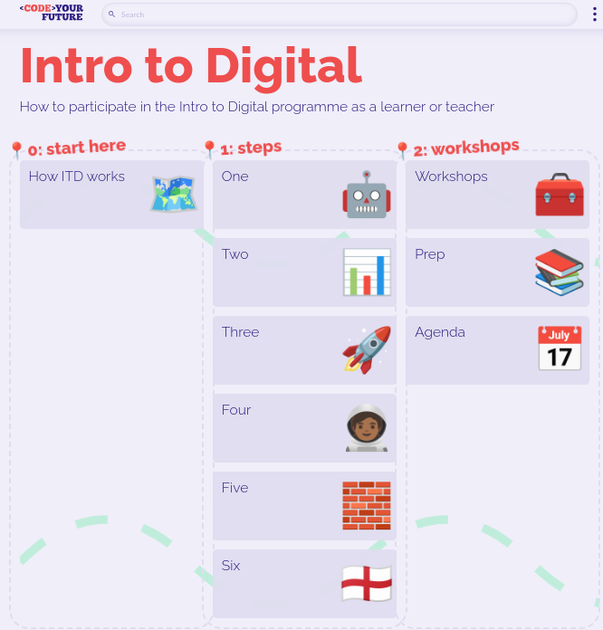
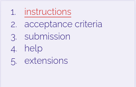
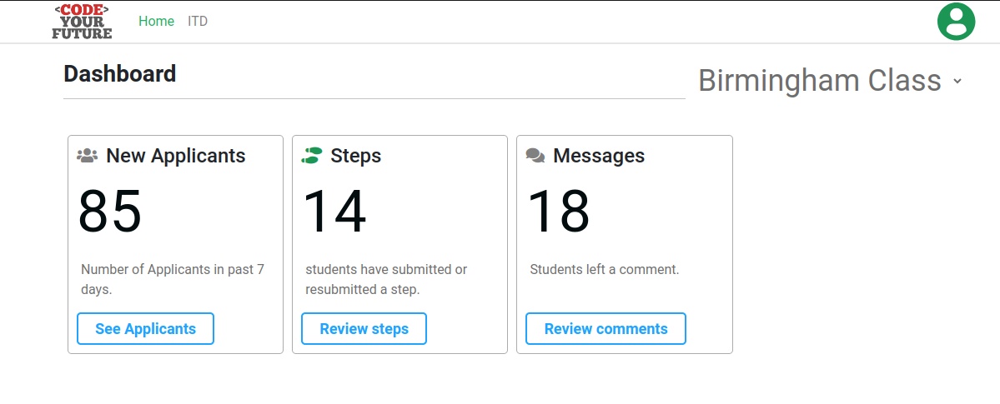

author: Tony Beaumont
summary: Information for CYF volunteers on ITD
id: docs
categories: digital 
environments: Web
status: Published
feedback link: mailto:a.j.beaumont@aston.ac.uk

# Instructions for ITD Volunteers

## Welcome

The information you will find here is the information I found useful as a volunteer helping with the Introduction to Digital programme.

### Introduction

The Introduction to Digital course is known as ITD.  You can find an overview of how ITD works here [https://cyf-itd.netlify.app/how-itd-works/](https://cyf-itd.netlify.app/how-itd-works/)

The role of volunteers is to review submissions by applicants and respond with feedback.  The submissions will be found on the Dashboard.  See below for the instructions on how to access the dashboard.

The Slack channel `#cyf-intro-to-digital-course` is for volunteers to discuss and ask questions, for example if you have questions about reviewing applicants work.  This channel has a canvas containing important information [https://codeyourfuture.slack.com/canvas/C01332PNRTN](https://codeyourfuture.slack.com/canvas/C01332PNRTN).  You **should read the canvas first**.  This document contains additional information to help you find your way around as a volunteer.

### What you should already know

As a volunteer you should:
* be able to spend some time on the tasks that need volunteers to complete so that CYF can function.  Volunteers enable CYF to achieve its goals.
* be digitally literate
* Your feedback to applicants will be guided by one or both of the following
  * technical expertise in some of the full stack development technologies including HTML, CSS, Javascript, React, SQL (Postgres)
  * expertise in personal skills to guide applicants in their personal development, for example in communication, presentation, time management, work-life balance, etc.

### What you'll learn

* How to register (if you are a new volunteer)
* How to access the dashboard
* Where to find the syllabus
* How to give helpful feedback.

### What you'll need

You will need a computer or tablet with this software installed:

* Slack
* A web browser

CYF generally uses (Ubuntu) Linux rather than Windows or Macs.  If you are trying to complete tasks that the applicants will do, instructions generally assume a Linux environment, so some experience of Linux would be helpful. 

### What you'll do

On the following pages we will take you through all the necessary information on volunteering with ITD guide your feedback to applicants.

* Access the Syllabus
* Access the dashboard
* Find applicant submissions and give feedback

## Where to find the ITD Syllabus

Before you can review the work submitted by applicants, you should familiarise yourself with the syllabus.

The syllabus for ITD is here: [https://cyf-itd.netlify.app/](https://cyf-itd.netlify.app/). This is a screenshot of the syllabus home page: 

Applicants will work through the steps week by week.  Each step contains instructions for the applicants to do complete a task which they should then submit.  Volunteers can find these submissions on the dashboard and give feedback.  There is a page which just contains the steps in order and that is here: [https://cyf-itd.netlify.app/steps/](https://cyf-itd.netlify.app/steps/).  The Workshops will be organised by each region, and are designed to be face-to-face opportunities for applicants to ask questions and clarify their learning.  Workshops will be advertised on Eventbrite and advertised in slack.

You will find that each step has a number of sub-components reachable via a menu which looks like this: .
* The **Instructions** tell the applicant what to do.  Volunteers should read this too so that you fully understand what is being asked of the volunteers in each step.
* The **acceptance criteria** list everything the the applicant must do to successfully complete the step.  
* The **Submission** item tells the applicants what to submit.  Volunteers can find these submissions in the dashboard.  
* The **Help** item tells the applicants how to get help.  
* The **Extensions** item gives a suggestion of other things a applicant can do in this step, but which don't have to be submitted.

## How to access the Dashboard

These instructions come from **Step 4** in the `#cyf-intro-to-digital-course` canvas ([https://codeyourfuture.slack.com/canvas/C01332PNRTN](https://codeyourfuture.slack.com/canvas/C01332PNRTN) so please refer to that first as it contains links to the instructions your should  follow to access the dashboard.  The information below is just designed to summarise those instructions..

1. Volunteers need to access the Dashboard [https://dashboard.codeyourfuture.io/](https://dashboard.codeyourfuture.io/)
1. Sign in using GitHub.  
1. If you are just registering as a new volunteer you should complete the application form.
1.  If you have already registered, click the link at the top which says 
	```console
	Important: If you already completed this form in some point please click here.
	```
	This takes you to a page where you enter your email address and you will then get sent an email to confirm your login and thereafter you will be able to access the dashboard directly.  If you have problems, post a question into the slack channel `#cyf-intro-to-digital-course`<br/>
1. Once you are in, the home screen of the dashboard looks like this: 
	<br/>
	The menu at the top has links to the home page and the ITD programme.  There will be other programs linked here as and when they start and have applicants on them.

## Using the dashboard:  Seeing Applicants

If you click on `See Applicants` in the **New Applicants** box, you will see a list of all the new applicants.
	

You can filter to see applicants in different areas, although you may only be able to access your local area's applicants. In my screen I can download a CSV file containing the details of the applicants, but you may not have this option.

## Using the dashboard: Reviewing work submitted by applicants

If you click on `Review Steps` in the **Steps** box you will see a list of those applicants who have submitted work for one or more of the steps in the ITD syllabus.  The view is a subset of all the applicants and looks similar:
	
	
> aside positive
> ### Important
> 
> Reviewing work submitted by the applicants is a core task for volunteers.  You should prioritise reviewing submitted work.

* Click on the **name** of one of the applicants.  You will see a menu appear like this one:
	.
* If you click on **Steps** you will see what the applicant has submitted for the ITD steps.  The example below shows the applicant has submitted work for three steps and you are looking at their submission link for STEP 1:
	
	Clicking the **Submitted** link will allow you to see their submitted work.  

Here are the things you can do when reviewing an applicant's work:
* **Communicating with the applicant**: If you click the comment button 
	
	you can see comments left by other volunteers and add your own comments.  You should post a comment back to the applicant if you have questions and you are not yet able to approve or reject the work.
* **Approving work**:  When you are ready to approve the submitted work as meeting the acceptance criteria, click the Approve button.  If you want to highlight work that you thought was good practice (or bad practice), leave a comment. 
	
* **Rejecting work**: If you are rejecting the work as not meeting the acceptance criteria, click the reject button 
	
	You should leave comments to say why the work was rejected.
* **Undoing a decision**: If you want to change your mind about approving or rejecting a piece of work, can click the Undo button as shown in this screenshot:
	

## Using the dashboard: Workshops

If you click the **Workshops** option under a applicant's name, you are able to record whether or not they attended a workshop and leave some text as context.  Here is what the option looks like:
	

## To be continued...
